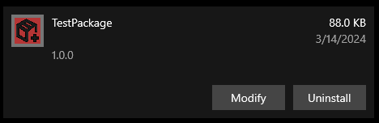

# MSICompiler

MSICompiler is a tool to create MSI packages for Windows. 
It is a simple tool that uses a configuration file to create the MSI package. 
It is written in Python and uses the `msilib` library to create the MSI package.


### [Download](https://github.com/camratchford/MSICompiler/releases/download/stable/MSICompiler_1.0.1.zip)

## Features

- YAML-based configuration
- Placing a directory full of files into a specified location
  - Contents of directory (but not the directory itself) are removed on uninstall
- Custom install / uninstall actions
  - Powershell action (Briefly shows the powershell window before closing)
  - Executable action (Relative paths are relative to the destination folder)
- Environment variables
  - Set
  - Append
  - Remove
- Package appears in Add/Remove Programs

## Limitations

- No GUI
- Testing is minimal, not all edge cases have been explored.
- Environment variables are not removed on uninstall
- Environment variables are applied to the logon user rather than the system
- Many of the features that MSI packages support are not supported by MSICompiler
  - Registry keys
  - Services


> See the Future Plans section for more features lacking in MSICompiler

## Usage

To use MSICompiler, you need to create a configuration file.

Below is a sample configuration file: 

### `tests/fixtures/config.yaml`

```yaml
---
source_folder: '.\fixtures\testpack'
destination_folder: '.\outputs\testdest'
custom_install_actions:
  - name: TestInstallAction1
    type: powershell
    target: '{destination_folder}\script.ps1'
    args:
      - 1
      - 2
  - name: TestInstallAction2
    type: executable
    target: 'C:\Windows\System32\msg.exe'
    args:
      - '*'
      - 'Test Message'
custom_uninstall_actions:
  - name: TestUninstallAction1
    type: executable
    target: 'C:\Windows\System32\msg.exe'
    args:
      - '*'
      - 'Uninstall Test Message'
msi_package_path: '.\outputs\{package_name}_{package_version}.msi'
package_name: TestPackage
product_code: '{39CFB886-7C1D-4469-A9C1-0C578E1C36D8}'
package_version: '1.0.0'
company: RatchfordConsulting
manufacturer: RatchfordManufacturing
msi_properties:
  ARPCONTACT: camratchford@gmail.com
  ARPPRODUCTICON: '{destination_folder}\package-box.ico'
  ARPURLINFOABOUT: https://support.ratchfordconsulting.com/
  ARPREADME: '{destination_folder}\README.txt'
  UpgradeCode: '{product_code}'
environment_variables:
  - name: PATH
    value: 'C:\Program Files\MyApp'
    mode: append
    delimiter: ';'
  - name: MYAPP_HOME
    value: 'C:\Program Files\MyApp'
    mode: set
    # no delimiter required, any entry will be ignored
  - name: DEPRECATED_MYAPP_VAR
    # no value required, any entry will be ignored
    mode: remove
    # no delimiter required, any entry will be ignored

```

To create the MSI package, you can use the following command:
```powershell
cd tests
MSICompiler.exe -c "config.yaml"
```

To install the msi package, you can use the following command:
```powershell
# The full path must be provided if executing the MSI with msiexec
msiexec /i /qn "$(Resolve-Path ./outputs/TestPackage_1.0.0.msi)" -log "install.log"

# This method relies on file extension handlers, but it is generally safe to assume that .msi is mapped correctly
./outputs/TestPackage_1.0.0.msi
```

To uninstall the msi package, you can use the following command:
> The 'uninstall' registry key has not been populated with the UninstallString, so the package must be uninstalled using the product code
```powershell
msiexec /X'{39CFB886-7C1D-4469-A9C1-0C578E1C36D8}' /qn -log "uninstall.log"
```

## Future Plans

> Feel free to submit a feature request as an issue
- Conditional install
- Logging / Better error handling
- Registry keys
- Scheduled tasks
- Services
- GUI
